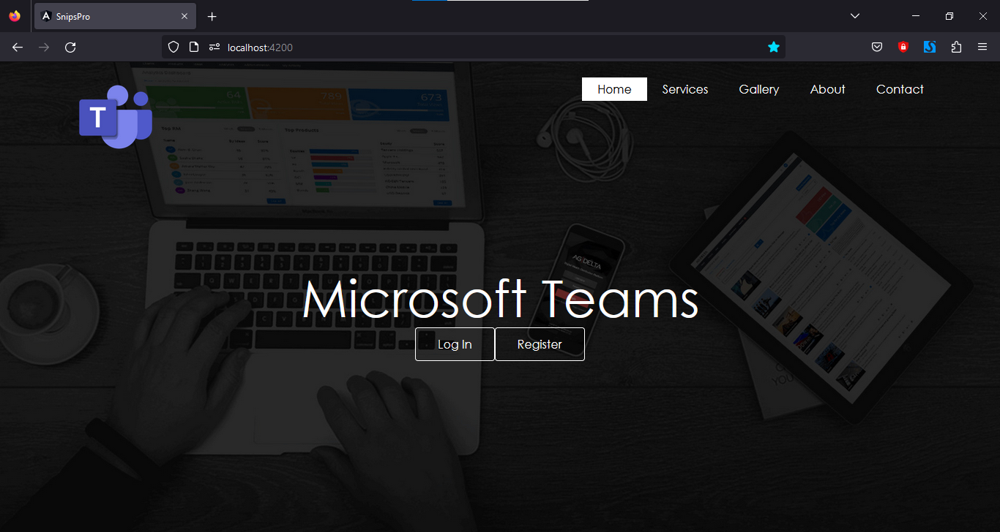
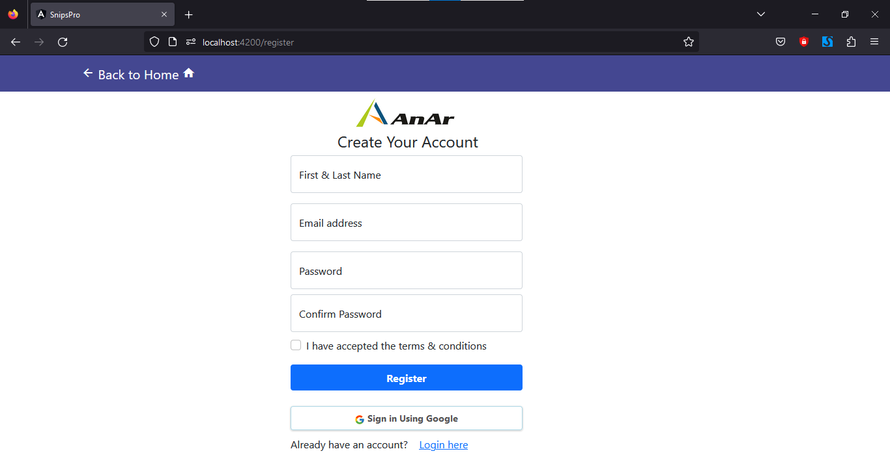
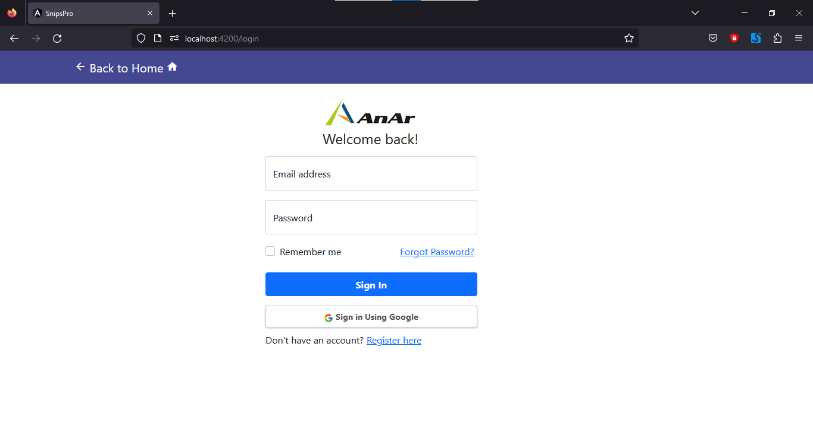
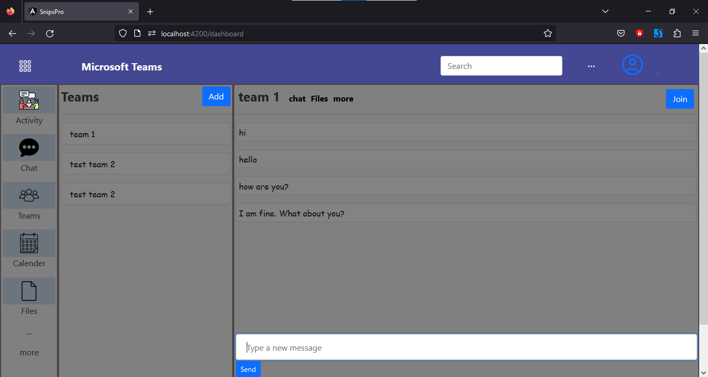
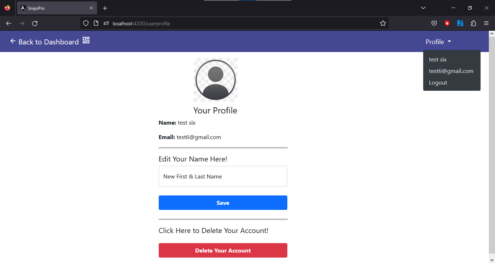

# Teams Chat App

It is a Microsoft Teams UI based chat app where you can create teams among registered users and chat with them.

## Run Locally

Clone the project

```bash
  git clone https://github.com/PratikKontamwar/Teams-Chat-App.git
```

Go to the project directory

```bash
  cd Teams-Chat-App
```

Install dependencies

```bash
  npm install
```

Start the server

```bash
  npm run start
```
Then visit http://localhost:4200 in your browser.
## Screenshots

- Home Screen
<p align="center">
  
</p>

- Sign-Up Page
<p align="center">
  
</p>

- Login Page
<p align="center">
  
</p>

- Dashboard Screen
<p align="center">
  
</p>

- User Profile Page
<p align="center">
  
</p>

# Technologies

- [NodeJS](https://nodejs.org/) - JavaScript backend/server-side solution of choice

- [Express](https://expressjs.com/) - Node framework that makes handling http requests with ease

- [MongoDB](https://www.mongodb.com/) - data storage solution that just speaks JSON and pairs very well with Node

- [Angular](https://angular.io/) - rich frontend web framework, helps creating fast, reliable web applications

  - [Angular-CLI](https://cli.angular.io/) - command line interface for streamlined angular development

  - [TypeScript](https://www.typescriptlang.org/) - superset of JavaScript that can be compiler-checked, also has types!!

  - [Bootstrap](http://getbootstrap.com/) - CSS/JS framework, makes it easy to develop responsive, well polished web apps

# [Issues](https://github.com/PratikKontamwar/Teams-Chat-App/issues)

If you want to help don't hesitate to come up with ideas, bug reports, make pull requests, all you can do. Also if you have any questions, please use the same issues page